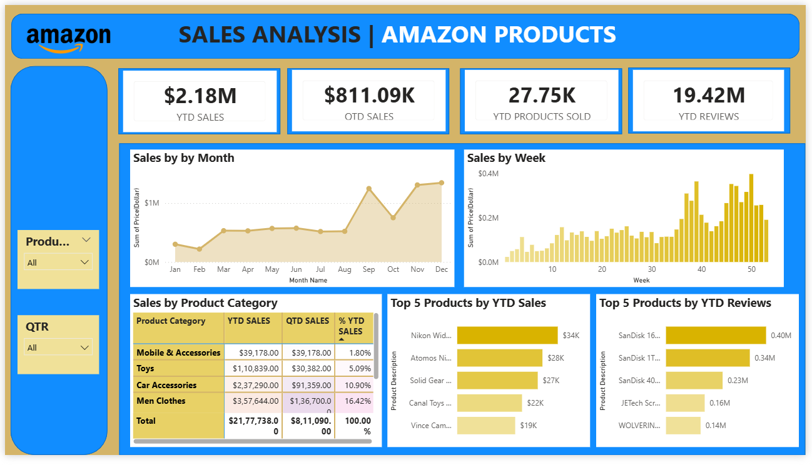

# 🛒 Amazon Sales Analysis 

_An interactive Sales Analysis Dashboard built using Amazon product data to track revenue performance, product trends, and customer engagement metrics.
This project focuses on analyzing sales performance using Excel (data source) and Power BI (visualization & analytics) to generate business insights._

---

## 📌 Table of Contents
- <a href="#overview">Overview</a>
- <a href="#business-problem">Business Problem</a>
- <a href="#dataset">Dataset</a>
- <a href="#tools--technologies">Tools & Technologies</a>
- <a href="#project-structure">Project Structure</a>
- <a href="#data-cleaning--preparation">Data Cleaning & Preparation</a>
- <a href="#research-questions--key-findings">Research Questions & Key Findings</a>
- <a href="#dashboard">Dashboard</a>
- <a href="#power-bi-dax-measures">Power BI DAX Measures</a>
- <a href="#final-recommendations">Final Recommendations</a>
- <a href="#author--contact">Author & Contact</a>

---
<h2><a class="anchor" id="overview"></a>Overview</h2>

The objective of this project is to analyze Amazon product sales data and uncover insights related to:
- Year-to-Date (YTD) Sales
- Quarter-to-Date (QTD) Sales
- Product performance trends
- Weekly & monthly sales patterns
- Customer review impact
- The dashboard enables stakeholders to monitor KPIs and make informed business decisions.

---
<h2><a class="anchor" id="business-problem"></a>Business Problem</h2>

Amazon's product ecosystem generates large volumes of transactional data across categories, time periods, and customer interactions. Without structured analytics:

- Revenue trends remain difficult to monitor at granular levels
- Product-level performance insights are fragmented
- Seasonal and weekly sales patterns are underutilized
- Customer engagement metrics (reviews) are not integrated into performance analysis

This project addresses these gaps by building a centralized analytical dashboard with time-intelligence capabilities.

---
<h2><a class="anchor" id="dataset"></a>Dataset</h2>

- CSV file located in `/data/` folder (amazon_sales_analysis)

---

<h2><a class="anchor" id="tools--technologies"></a>Tools & Technologies</h2>

- Power BI (Dashboard & DAX Measures)
- Power Query (Data Transformation)
- Microsoft Excel (Data Source)
- GitHub

---
<h2><a class="anchor" id="project-structure"></a>Project Structure</h2>

```
amazon-sales-analysis-power-bi-excel/
│
├── README.md                              # Project documentation
├── .gitignore                             # Git ignore file
├── Amazon_Sales_Analysis_Report.pdf       # Final analysis report
│
├── data/                                  # Raw data folder
│   └── amazon_sales_data.csv             # Sales transaction data
│
├── dashboard/                             # Power BI files
│   └── amazon_dashboard.pbix             # Interactive Power BI dashboard
│
├── Images/                                # Dashboard screenshots
│   └── dashboard.png                     # Dashboard visualization
│
└── Documentation/                         # Additional documentation
    └── DAX_Measures.md                   # Detailed DAX formulas
```


---
<h2><a class="anchor" id="data-cleaning--preparation"></a>Data Cleaning & Preparation</h2>

- Data transformation followed BI practices:
  - Data type validation (numeric, date, categorical)
  - Standardization of product and category labels
  - Creation of a structured Date/Calendar table
  - Development of Year → Quarter → Month → Week hierarchy
  - Removal of inconsistencies and redundant columns
  - Validation of aggregation consistency

This step ensured analytical reliability and performance optimization.

- **Data Modeling (Star Schema Approach)**
A star schema model was implemented to enhance scalability and performance.

 **Model Structure**
  - Fact Table: Sales (transaction-level data)
  - Dimension Tables: Date (Calendar), Product (Category, Description)

**Key Modeling Practices**
- One-to-many relationships from dimensions to fact table
- Single-direction filtering to avoid ambiguity
- Separate Date table to enable time-intelligence functions
- Optimized model to reduce cardinality where possible

This modeling approach ensures accurate time-based calculations and efficient report performance.

---
<h2><a class="anchor" id="research-questions--key-findings"></a>Research Questions & Key Findings</h2>

**1. Revenue Trends**
 - Noticeable sales acceleration toward later months indicates seasonal demand impact.
 - Weekly spikes suggest promotional campaigns or peak demand periods.

**2. Product Performance**
 - Revenue concentration exists within specific product categories.
 - Top-selling products differ from most-reviewed products, indicating demand vs engagement variation.

**3. Engagement Analysis**
 - High review counts do not always translate to proportional revenue contribution.
 - Engagement metrics provide complementary insights to revenue metrics.


---
<h2><a class="anchor" id="dashboard"></a>Dashboard</h2>

- Power BI Dashboard:
**KPI Layer (Top Section)**
 - YTD Sales ($2.18M)
 - QTD Sales ($811.09K)
 - YTD Products Sold (27.75K)
 - YTD Reviews (19.42M)

**Trend Analysis Layer**
 - Sales by Month (seasonality detection)
 - Sales by Week (short-term fluctuation analysis)

**Performance Analysis Layer**
 - Sales by Product Category (YTD vs QTD comparison)
 - Top 5 Products by YTD Sales
 - Top 5 Products by YTD Reviews



---

<h2><a class="anchor" id="power-bi-dax-measures"></a>Power BI DAX Measures</h2>


The following DAX measures were created to calculate KPIs and enable time-based analysis:

**Core KPI Measures**

1. Calculates cumulative sales from the beginning of the year to the selected date.
```bash
YTD Sales = TOTALYTD(SUM(Sales[Sales Amount]), 'Calendar'[Date])
``` 

2. Calculates cumulative sales from the beginning of the quarter.
```bash
QTD Sales = TOTALQTD(SUM(Sales[Sales Amount]), 'Calendar'[Date])
```

3. Tracks total quantity sold year-to-date.
```bash
YTD Products Sold = TOTALYTD(SUM(Sales[Quantity]), 'Calendar'[Date])
```

4. Measures customer engagement via accumulated reviews.
```bash
YTD Reviews = TOTALYTD(SUM(Sales[Reviews]), 'Calendar'[Date])
```

---
<h2><a class="anchor" id="final-recommendations"></a>Final Recommendations</h2>

- **Revenue Optimization**
 - Align marketing spend with high-performing months.
 - Introduce upselling and bundling strategies for top revenue-generating products.

- **Inventory & Operations**
 - Use weekly demand patterns for inventory forecasting.
 - Prepare stock allocation based on seasonal spikes.

- **Product Strategy**
 - Promote high-review products to increase conversion.
 - Reassess underperforming categories for pricing or repositioning strategies.

- **Executive Reporting**
 - Implement monthly performance reviews using YTD vs QTD comparisons.

---
<h2><a class="anchor" id="author--contact"></a>Author & Contact</h2>

**Shruti Bade**  
Data Analyst  
📧 Email: shrutibade12@gmail.com 
🔗 [LinkedIn](https://www.linkedin.com/in/shruti-bade)  
